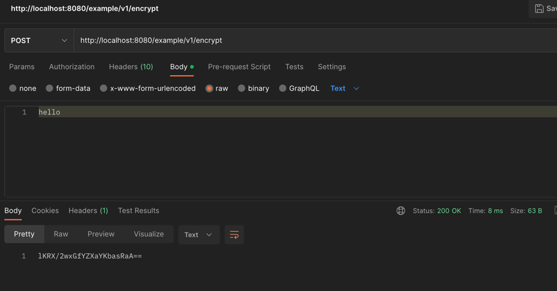

# Use plugin native image builder.
```xml
<plugin>
  <groupId>org.graalvm.buildtools</groupId>
  <artifactId>native-maven-plugin</artifactId>
  <executions>
    <execution>
      <goals>
        <goal>build</goal>
      </goals>
      <phase>package</phase>
    </execution>
  </executions>
  <configuration>
    <imageName>${project.name}</imageName>
    <mainClass>org.example.Main</mainClass>
  </configuration>
</plugin>
```

# Add the build args mentioning what needs to initialized at build time and what needs to be initialized at run time.
```shell
Args =\
-H:EnableURLProtocols=http,https \
-H:+PrintClassInitialization \
-H:+ReportExceptionStackTraces \
-H:+ReportExceptionStackTraces \
-H:ReflectionConfigurationResources=${.}/reflect-config.json \
-H:JNIConfigurationResources=${.}/jni-config.json \
-H:ResourceConfigurationResources=${.}/resource-config.json \
-H:ConfigurationFileDirectories=${.} \
--no-fallback \
--enable-http \
--enable-https \
--gc=serial \
-R:MaximumHeapSizePercent=70 \
-R:MinHeapSize=300m \
--initialize-at-run-time=io.netty \
--features=org.example.features.BouncyCastleFeature
```

# Config file name should be like
```shell
resources/META-INF/native-image/{group-id}/{artifact-id}/native-image.propertis
```

# Build JAR
```shell
mvn clean install -Djar
```

# If some of the dependecies failing to initialize we can generate the reflection details for the native images by running the application using below options
```shell
java -agentlib:native-image-agent=config-output-dir=<DIRECTORY_YOU_WANT_THE_FILES_TO_BE_GERERATED_AT> -jar <JAR_FILE>.jar
```

# Build native image
```shell
mvn clean install -Pnative
```

# Registering BouncyCastle as security provider using Feature
``` java

public class BouncyCastleFeature implements Feature {
  /**
   * @param access The supported operations that the feature can perform at this time
   *               Description:
   *               1. Register bouncy castle provider at build time.
   *               2. Re-initializing the DRGB default and NonceAndIV at run time as we need seed for random generators.
   *               We can not use compile time static seed for random generation.
   *               3. We will provide this feature to native-image builder, so that it can use and register bouncy castle(BC) along with SunJCE crypto providers.
   */
  @Override
  public void afterRegistration(AfterRegistrationAccess access) {
    RuntimeClassInitialization.initializeAtBuildTime("org.bouncycastle");
    final var rci = ImageSingletons.lookup(RuntimeClassInitializationSupport.class);
    rci.rerunInitialization("org.bouncycastle.jcajce.provider.drbg.DRBG$Default", "");
    rci.rerunInitialization("org.bouncycastle.jcajce.provider.drbg.DRBG$NonceAndIV", "");
    Security.addProvider(new BouncyCastleProvider());
  }
}

```

# Kotlin data types Any etc to work.
```json
{
  "name": "kotlin.reflect.jvm.internal.ReflectionFactoryImpl",
  "allDeclaredConstructors": true
},
{
  "name": "kotlin.KotlinVersion",
  "allPublicMethods": true,
  "allDeclaredFields": true,
  "allDeclaredMethods": true,
  "allDeclaredConstructors": true
},
{
  "name": "kotlin.KotlinVersion[]"
},
{
  "name": "kotlin.KotlinVersion$Companion"
},
{
  "name": "kotlin.KotlinVersion$Companion[]"
}
```

# Supported endpoint
```shell
REQUEST
Method: POST
URL: http://localhost:8080/example/v1/encrypt
Content-type: text/plain
body: {plain_string}

RESPONSE
encrypted base64 encoded string version of request plain_string
```



# Never use Epsilon GC
The Epsilon GC (available with GraalVM 21.2 or later) is a no-op garbage collector that does not do any garbage collection and therefore never frees any allocated memory. The primary use case for this GC are very short running applications that only allocate a small amount of memory. To enable the Epsilon GC, specify the option --gc=epsilon at image build time.
